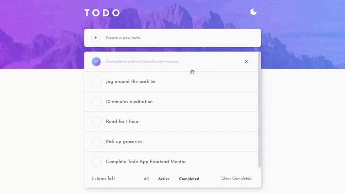

# Frontend Mentor - Todo app solution

This is a solution to the [Todo app challenge on Frontend Mentor](https://www.frontendmentor.io/challenges/todo-app-Su1_KokOW). Frontend Mentor challenges help you improve your coding skills by building realistic projects.

## Table of contents

- [Overview](#overview)
  - [The challenge](#the-challenge)
  - [Screenshots](#screenshots)
  - [Links](#links)
- [My process](#my-process)
  - [Built with](#built-with)
  - [What I learned](#what-i-learned)
    - [Modal alert](#modal-alert)
    - [IndexedDB](#indexeddb)
  - [Useful resources](#useful-resources)
- [Author](#author)

## Overview

### The challenge

Users should be able to:

- View the optimal layout for the app depending on their device's screen size
- See hover states for all interactive elements on the page
- Add new todos to the list
- Mark todos as complete
- Delete todos from the list
- Filter by all/active/complete todos
- Clear all completed todos
- Toggle light and dark mode
- **Bonus**: Drag and drop to reorder items on the list

### Screenshots

Light theme


Dark Theme


Modal window

  


Drag and Drop  
<div align="center" width="100%">
     
</div>


### Links

- Live Site URL: [Todo App](https://rojaence.github.io/todo-app/)

## My process

### Built with

- Semantic HTML5 markup
- Flexbox
- CSS Grid
- SCSS
- Mobile-first workflow
- Local Storage
- IndexedDB
- [React](https://reactjs.org) - JS Framework
- [react-beautiful-dnd](https://github.com/atlassian/react-beautiful-dnd) - Beautiful and accesible drag and drop

### What I learned

#### Modal alert

How to create a modal alert using a custom component and hook

```js
// Render in custom component - Alert.jsx

  return (
    <div className={modalClassStyle()} onClick={closeAlert}>
      <div className="modal-wrapper__content">
        <article
          className={alertClassStyle()}
          onClick={handleAlertContainerClick}
        >
          <Icon name={icon} size={100} />
          <h2 className="modal__title">{message}</h2>
          <footer className="alert__actions">
            {cancelButton && (
              <Button
                text="Cancel"
                onClick={closeAlert}
                customClass="error-accent"
                outlined
              />
            )}

            {confirmButton && (
              <Button
                text="Ok"
                ref={successButton}
                onClick={confirmBtnOnClick}
                customClass="success-accent"
                outlined
              />
            )}
          </footer>
        </article>
      </div>
    </div>


// Custom hook - useAlert.jsx
import { useState } from "react";

export const useAlert = (initialValue = false, initialConfig = {}) => {
  const [isOpen, setIsOpen] = useState(initialValue);
  const [config, setConfig] = useState(initialConfig);

  const openAlert = (newConfig) => {
    setConfig(newConfig);
    setIsOpen(true);
  };

  const closeAlert = () => setIsOpen(false);

  return {isOpen, openAlert, closeAlert, config};
};

```

Usage example

```js
// TaskList.jsx
import { useAlert } from "@/hooks/useAlert";
import Alert from "@/components/Alert";

const taskAlert = useAlert(false);

const clearBtnClick = () => {
  if (tasks.filter((t) => t.completed).length > 0) {
    taskAlert.openAlert({
      message: "Are you sure you want to delete all completed tasks?",
      color: "warning",
      icon: "help-outline",
      cancelButton: true,
      confirmButton: true,
      confirmAction: deleteCompletedTasks,
    });
  } else {
    taskAlert.openAlert({
      message: "There are no completed tasks",
      color: "warning",
      icon: "alert-outline",
      confirmButton: true,
    });
  }
};

// In render
<Alert
  {...taskAlert.config}
  show={taskAlert.isOpen}
  closeAlert={taskAlert.closeAlert}
></Alert>;
```

#### IndexedDB


Establish a connection with the native API

```js
// TaskState.jsx

const indexedDBConnection = () => {
  const indexedDB = window.indexedDB;
  let db;
  if (indexedDB) {
    const request = indexedDB.open("reactTodoAppDB", 1);
    request.onsuccess = () => {
      db = request.result;
      state.todoAppDB = db;
      getTasks();
    };
    request.onupgradeneeded = (e) => {
      db = e.target.result;
      state.todoAppDB = db;
      const objectStore = db.createObjectStore("todoList", {
        keyPath: "title",
      });
    };
    request.onerror = (error) => {
      console.log("Error", error);
    };
  }
};
```

```js
// Get tasks from the store
const getTasks = () => {
  try {
    const transaction = state.todoAppDB.transaction(["todoList"], "readonly");
    const objectStore = transaction.objectStore("todoList");
    const request = objectStore.openCursor();
    let todoData = [];
    state.maxPriority = 0;
    request.onsuccess = (e) => {
      const cursor = e.target.result;
      if (cursor) {
        todoData.push(cursor.value);
        if (cursor.value.priority > state.maxPriority)
          state.maxPriority = cursor.value.priority;
        cursor.continue();
      } else {
        todoData.sort((a, b) => {
          if (a.priority < b.priority) {
            return -1;
          } else if (a.priority > b.priority) {
            return 1;
          } else {
            return 0;
          }
        });
        dispatch({ type: GET_TASKS, payload: todoData });
      }
    };
  } catch (error) {
    console.log(error);
  }
};
```

Function to add a new task to indexedDB store

```js
const addTask = async ({ title }) => {
  let data = {
    title,
    completed: false,
    priority: state.maxPriority + 1,
  };
  const transaction = state.todoAppDB.transaction(["todoList"], "readwrite");
  const objectStore = transaction.objectStore("todoList");
  await objectStore.add(data);
  getTasks();
};
```

In this solution the tasks are ordered by priority; the next
functions allow reorder the priority data when a task is deleted or
the order changes with drag and drop.

```js
// When a task is deleted

const deleteTask = async (key) => {
  let reference = state.tasks.find((t) => t.title === key);
  const transaction = state.todoAppDB.transaction(["todoList"], "readwrite");
  const objectStore = transaction.objectStore("todoList");
  const request = objectStore.openCursor();
  request.onsuccess = async (e) => {
    const cursor = e.target.result;
    if (cursor) {
      let item = cursor.value;
      if (item.priority > reference.priority) {
        item.priority -= 1;
        await objectStore.put(item);
      }
      cursor.continue();
    } else {
      await objectStore.delete(key);
    }
  };
};

// When the order changes with drag and drop
const reorderTasks = (target, reference) => {
  const transaction = state.todoAppDB.transaction(["todoList"], "readwrite");
  const objectStore = transaction.objectStore("todoList");
  const request = objectStore.openCursor();
  request.onsuccess = async (e) => {
    const cursor = e.target.result;
    if (cursor) {
      let item = cursor.value;
      if (item.title == target.title) {
        item.priority = reference.priority;
      } else if (item.title != target.title) {
        if (
          target.priority < reference.priority &&
          item.priority > target.priority &&
          item.priority <= reference.priority
        ) {
          item.priority -= 1;
        } else if (
          target.priority > reference.priority &&
          item.priority < target.priority &&
          item.priority >= reference.priority
        ) {
          item.priority += 1;
        }
      }
      await objectStore.put(item);
      cursor.continue();
    } else {
      getTasks();
    }
  };
};
```

When all completed tasks are deleted, all necessary priorities are changed

```js
// When all completed tasks are deleted
const deleteTaskGroup = async (taskGroup) => {
  let currentPriority = 0;
  taskGroup.sort((a, b) => {
    return a.priority - b.priority;
  });
  let activeTasks = state.tasks
    .slice()
    .filter((task) => !taskGroup.some((t) => t.title === task.title));
  for (let index = 0; index < activeTasks.length; index++) {
    if (activeTasks[index].priority !== currentPriority + 1) {
      activeTasks[index].priority = currentPriority + 1;
    }
    currentPriority++;
  }
  const transaction = state.todoAppDB.transaction(["todoList"], "readwrite");
  const objectStore = transaction.objectStore("todoList");
  const request = objectStore.openCursor();
  request.onsuccess = async (e) => {
    const cursor = e.target.result;
    if (cursor) {
      if (taskGroup.some((task) => task.title === cursor.key))
        await objectStore.delete(cursor.key);
      else {
        let task = activeTasks.find((task) => task.title === cursor.key);
        if (task.priority !== cursor.value.priority) {
          await objectStore.put(task);
        }
      }
      cursor.continue();
    } else {
      getTasks();
    }
  };
};
```

### Useful resources

- [Sweetalert](https://sweetalert2.github.io/) - This helped me to define a modal window layout. I really liked this pattern and will use it going forward.

## Author

- Frontend Mentor - [@rojaence](https://www.frontendmentor.io/profile/rojaence)
- Twitter - [@EndaraRonny](https://www.twitter.com/EndaraRonny)
- LinkedIn - [Ronny Endara](https://www.linkedin.com/in/ronny-endara)
- Platzi - [Profile](https://platzi.com/p/rojaence/)
