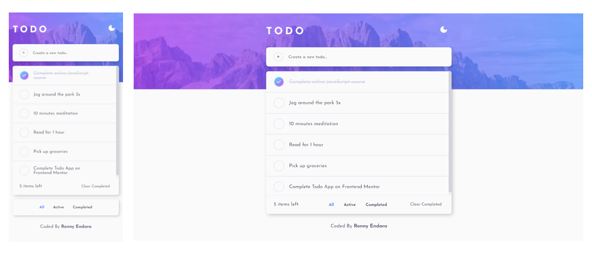
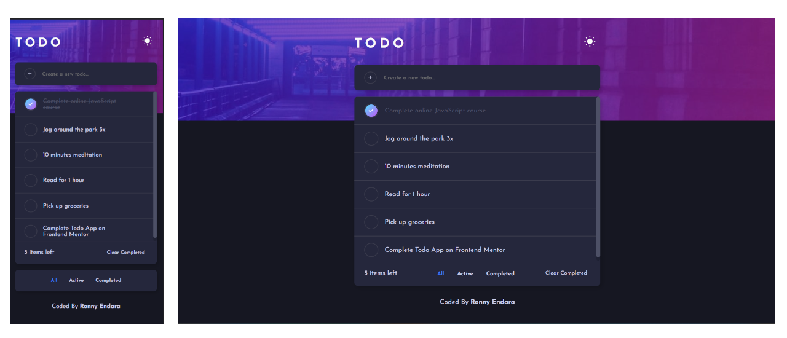
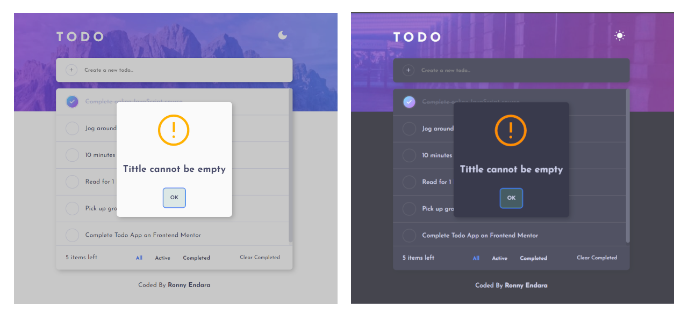
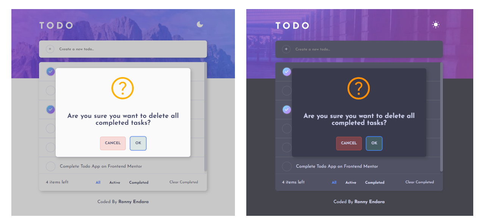

# Frontend Mentor - Todo app solution

This is a solution to the [Todo app challenge on Frontend Mentor](https://www.frontendmentor.io/challenges/todo-app-Su1_KokOW). Frontend Mentor challenges help you improve your coding skills by building realistic projects. 

## Table of contents

- [Overview](#overview)
  - [The challenge](#the-challenge)
  - [Screenshots](#screenshots)
  - [Links](#links)
- [My process](#my-process)
  - [Built with](#built-with)
  - [What I learned](#what-i-learned)
  - [Useful resources](#useful-resources)
- [Author](#author)

## Overview

### The challenge

Users should be able to:

- View the optimal layout for the app depending on their device's screen size
- See hover states for all interactive elements on the page
- Add new todos to the list
- Mark todos as complete
- Delete todos from the list
- Filter by all/active/complete todos
- Clear all completed todos
- Toggle light and dark mode
- **Bonus**: Drag and drop to reorder items on the list

### Screenshots

Light theme

  

Dark Theme  

  

Modal window  

  
  

Drag and Drop  
  

### Links

- Live Site URL: [Todo App](https://rojaence.github.io/FrontendMentor-Challenges/todo-app/)

## My process

### Built with

- Semantic HTML5 markup
- Flexbox
- CSS Grid
- SCSS
- Mobile-first workflow
- Local Storage
- IndexedDB
- [React](https://reactjs.org) - JS Framework
- [react-beautiful-dnd](https://github.com/atlassian/react-beautiful-dnd) - Beautiful and accesible drag and drop

### What I learned

How to create a modal window using a custom component and hook

```jsx
// Render in custom component - Alert.jsx

  return (
    <div className={modalClassStyle()} onClick={closeAlert}>
      <div className="modal-wrapper__content">
        <article
          className={alertClassStyle()}
          onClick={handleAlertContainerClick}
        >
          <Icon name={icon} size={100} />
          <h2 className="modal__title">{message}</h2>
          <footer className="alert__actions">
            {cancelButton && (
              <Button
                text="Cancel"
                onClick={closeAlert}
                customClass="error-accent"
                outlined
              />
            )}

            {confirmButton && (
              <Button
                text="Ok"
                ref={successButton}
                onClick={confirmBtnOnClick}
                customClass="success-accent"
                outlined
              />
            )}
          </footer>
        </article>
      </div>
    </div>


// Custom hook - useAlert.jsx
import { useState } from "react";

export const useAlert = (initialValue = false, initialConfig = {}) => {
  const [isOpen, setIsOpen] = useState(initialValue);
  const [config, setConfig] = useState(initialConfig);

  const openAlert = (newConfig) => {
    setConfig(newConfig);
    setIsOpen(true);
  };

  const closeAlert = () => setIsOpen(false);

  return {isOpen, openAlert, closeAlert, config};
};

```

```jsx
// Usage Example - TaskList.jsx


```

### Useful resources

- [Sweetalert](https://sweetalert2.github.io/) - This helped me to define a modal window layout. I really liked this pattern and will use it going forward.

## Author

- Frontend Mentor - [@rojaence](https://www.frontendmentor.io/profile/rojaence)
- Twitter - [@EndaraRonny](https://www.twitter.com/EndaraRonny)
- LinkedIn - [Ronny Endara](https://www.linkedin.com/in/ronny-endara)
- Platzi - [Profile](https://platzi.com/p/rojaence/)
